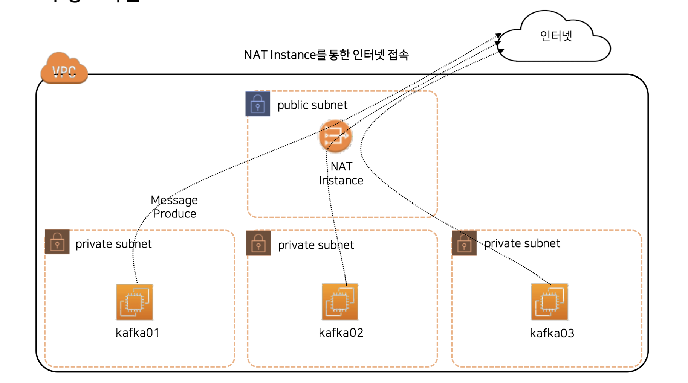

# NAT 인프라
----------
이번에 실시간 따릉이 대시보드 제작 프로젝트에 데이터 엔지니어 및 인프라로 참여하게 되었다. 
협업 및 배포의 용이성 때문에 클라우드를 이용하기로 결정이 났고 AWS에 EC2에 카프카 클러스터를 구축하고 프로듀서를 개발하기로 하였다.  
 

AWS를 이용한 협업은 처음이기에 세세하게 사전조사를 했는데 첫째로 알게 된 사실은 AWS에서 네트워크를 설계할때 NAT의 사용은 필수적이라는 것이다.  
 

보안상 카프카 클러스터 서버들을 외부에서 접근할 수 없게 해야하기 때문이다.  
 

때문에 VPC 인프라를 구축할때 Public 서브넷과 Private 서브넷을 만들어 그안에 EC2 인스턴스를 두고, Bastion Host를 통해 Public 서브넷에서 Priavate 서브넷으로 접속한 후, NAT Gateway를 통해서 외부 인터넷 소스를 사설망에서 받는 식으로 운용된다.  
 

그만큼 중요한 것으로 당연히 AWS에도 관련 서비스인 NAT Gateway가 존재하고 그것을 이용해서 손쉽게 사설망 외부 통신을 하지만, 아주 중요한 사실이 있었으니...  
 

NAT 게이트웨이는 서울 지역 기준으로 시간당 0.059달러의 비용이 발생하는데, 이걸 24시간 가동하고 있으면 강제로 물린 삼성전자 주식을 다 팔아야할 수도 있다.  
 

때문에 NAT Gateway가 아닌 NAT instance를 사용할 수 있는데 물론 단점이 명확하지만 프리티어 요금제를 사용하면 무료로도 사용가능하다.(무료가 포인트다^^)  
 

학생들이서 하는 토이 프로젝트이므로 퍼블릭 서브넷 기능 하나만 있으면 되기에 묻지도 따지지도 않고 NAT instance를 사용하기로 하였다.  

# NAT 인스턴스 vs Gateway
-----------------------
NAT Instance는 EC2 Instance를 NAT용으로 바꿔 사용하는 것을 말한다.

위 인프라는 이번에 내가 구성한 AWS 구성도다.
인프라 구성을 보면, Public subnet에 NAT instance가 위치하게 된다. 그리고 **EIP**를 부여 받아 외부의 트래픽을 받는다.  
 

또한, Private 서브넷의 route table에 **nat-instance-id**를 설정하고 public-nat의 보안 그룹을 수정하여 private 서브넷에서 오는 모든 TCP 요청과 ICMP을 받도록 설정한다.  
 
> EIP란?
> 인스턴스를 재시작해도 public IP가 변경되지 않도록 고정된 public IP를 제공하는 서비스를 말함.  
 
✅**NAT Instance**: 퍼블릭 서브넷 기능이 있는 하나의 EC2 서버다. 때문에 꺼지면 죽으며 위 구성도 처럼 단일 서버로 구축하기 때문에 SPOF가 될 수 있다. 토이 프로젝트에서만 사용하도록 하자ㅎㅎ

✅**NAT Gateway**: AWS에서 제공하는 서비스이기에 고가용성이 보장되서 죽지 않는다. SPOF라는 단점을 해결할 수 있다.  
 

| **NAT Instance**         | **NAT Gateway**           |
| ------------------------ | ------------------------- |
| 단일 인스턴스                  | AWS에서 제공하는 서비스            |
| = EC2                    | = 서비스                     |
| 서버가 꺼지면 죽음               | 꺼져도 죽지 않음 병렬로 구성(고가용성 보장) |
| 보안그룹에 영향을 받기에 일일이 설정해야 함 | 보안 그룹 영향 받지 않음            |
| Bastion을 겸할 수O           | Bastion을 겸할 수X            |

 
이제 NAT INSTANCE를 구성하는 방법은 다음 포스팅에서 다뤄보도록 하겠다.
